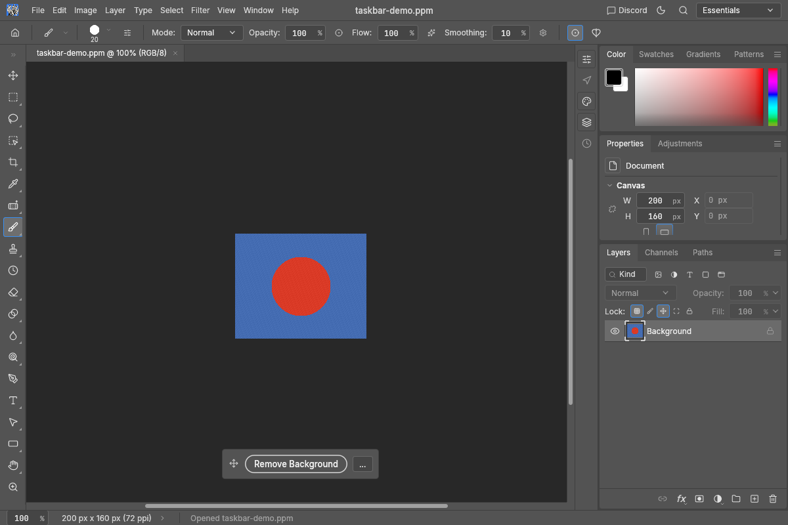
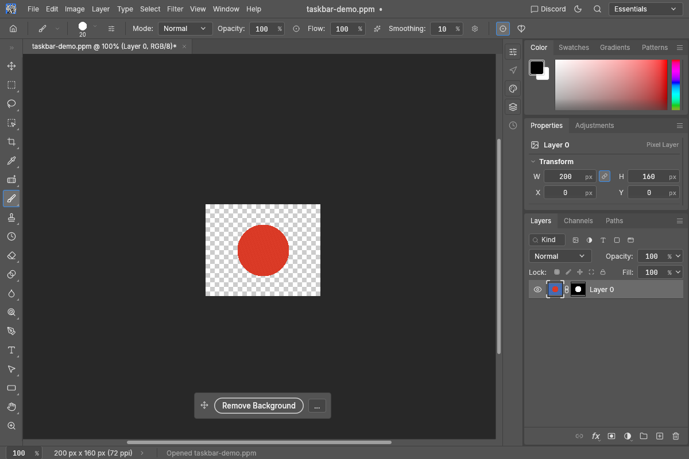

# Contextual task bar

The floating bar puts **Remove Background** on the canvas for the active pixel layer or
rendered Smart Object, including a photo placed by drag and drop. It starts visible; no
account or model download is required. It invokes the existing `layer.removeBackground`
command, which creates an editable layer mask in one Undo step. It keeps the source pixels,
Smart Object contents, bit depth and transform, and respects inherited pixel/all locks.
A Smart Object without a rendered image returns an error without editing the document.

The standalone contribution uses the built-in Classical method. The separate optional local
models contribution ([#1199](https://github.com/storytold/photocraft/pull/1199)) chooses the
method inside the same engine command; the bar does not select a model or start a download.
This feature introduces no provider integration or image generation controls.

## Placement and visibility

- Drag the grip at the left to move the bar. The gesture changes UI state without painting or
  adding a history step.
- Open **…** for **Reset position** or **Hide contextual task bar**. Restore a hidden bar with
  **Window › Contextual Task Bar**, whose check mark reflects visibility even with no document.
- Position is relative to the canvas viewport's available movement range, independent of image
  pixels and zoom. Window/dock resizing keeps it inside the viewport; very small viewports hide
  it until it fits. Visibility and position are saved through the existing preferences store.
- The bar appears for pixel/Smart Object layers and hides for other kinds, no document, hidden
  screen chrome, the Crop tool, active modal previews, Free Transform and the focused background-job dialog.
  An unavailable action is disabled using the existing command's enablement.

## Automation

The normal engine command remains available through the CLI, control channel and MCP.
The shell's view controls are also exposed:

```json
{"method":"ui.set","params":{"contextualTaskbar":{"visible":true,"position":[0.5,0.9]}}}
{"method":"ui.inspect","params":{}}
{"method":"ui.menu.invoke","params":{"id":"window.contextualTaskbar"}}
{"method":"ui.set","params":{"contextualTaskbar":{"position":null}}}
```

`ui.inspect` returns `contextualTaskbar` under its `result`. `ui.set` patches only the fields
provided; `null` position resets placement. Unknown nested keys, wrong types and positions
outside two finite numbers in 0..1 reject the entire request, including other valid UI fields
in that request. The stored state is serde-compatible with older UI settings.

## Validation

Focused regressions cover real drag/click dispatch on a placed photo, source preservation and
one-step Undo/Redo at 8/16/32-bit, locks and absent caches, modal suppression, reachability after
resize, settings persistence, menu recovery, atomic automation validation and catalog lookups
in every complete language. On macOS the full engine/UI/automation suites with HEIF passed:
1,170 / 1,740 / 52 unit tests, with 11 / 10 / 0 ignored, plus integration tests. Final lint/wasm and
platform results are recorded in the PR. Ignored cases are not counted as passes.

Offscreen captures use an original synthetic illustration, with the source and licence recorded
beside the images. They demonstrate the actual engine mask and UI, not model accuracy.






Replay from the repository root (no window or focus change):

```sh
cargo run -p photocraft-ui-egui --example snapshot -- --size 1200x800 --scale 1 --open docs/images/contextual-taskbar-demo.ppm --out before.png
cargo run -p photocraft-ui-egui --example snapshot -- --size 1200x800 --scale 1 --open docs/images/contextual-taskbar-demo.ppm --script '[["ui.menu.invoke",{"id":"layer.removeBackground"}]]' --out after.png
```

Asset provenance and licence: [LICENSE-contextual-taskbar.txt](images/LICENSE-contextual-taskbar.txt).
