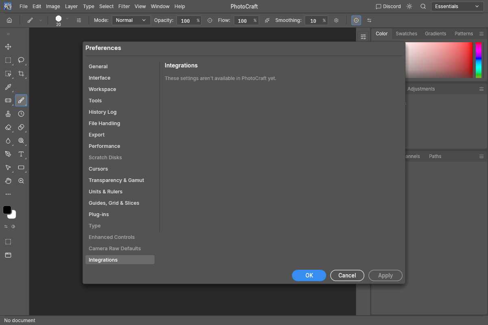
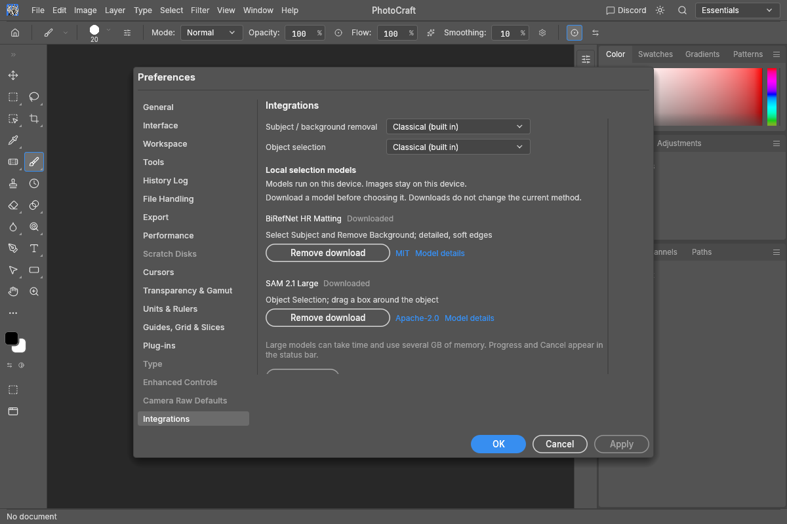
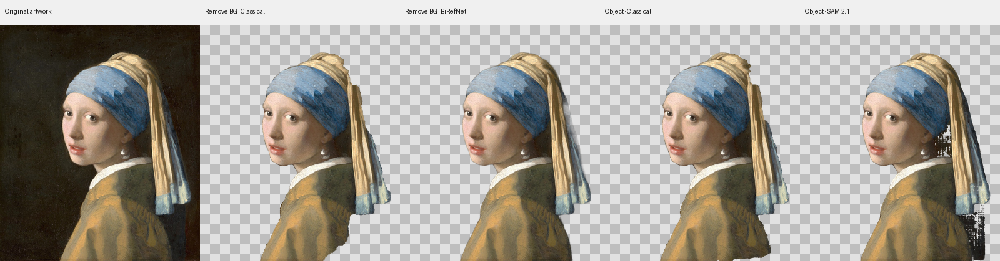

# Optional local models: validation

Recorded 2026-10-08 on an Apple M3 Max with 36 GiB RAM, Rust 1.98.0, native CPU inference
and the immutable model exports listed in [local-models.md](local-models.md). No learned weights
are included in this repository. This is an initial integration and performance check, not a
labelled accuracy benchmark or evidence that a model always improves on the classical method.

## Preferences before and after

Before, from the unmodified `5896f0b` source:



After, with both models explicitly downloaded into an isolated development cache. The two
methods still default to Classical. Downloads/removals use the engine's existing progress and
cancellation jobs; Apply/OK saves the method choices.



## Real model outputs and timings

The comparison uses Vermeer's public-domain *Girl with a Pearl Earring*. The 960 × 1137 source
was resized to 4500 × 5333 (23,998,500 pixels) to exercise the required 24 MP processing path;
upsampling does not add detail or make it an accuracy dataset. Each command ran twice in the
same session, with Undo restoring the input between runs. Timings include preparation, hash
verification, model loading on the first run, inference and document apply, excluding PNG export.

| Command / method | First run | Second run |
|---|---:|---:|
| Remove Background / Classical | 318 ms | 306 ms |
| Remove Background / BiRefNet HR Matting | 35,275 ms | 28,790 ms |
| Object Selection / Classical | 543 ms | 296 ms |
| Object Selection / SAM 2.1 Large | 7,112 ms | 5,555 ms |

For Object Selection, the same rectangle starts at 10% of the width and 5% of the height and
covers 85% × 95% of the canvas. Selection was converted to a layer mask only for export.
The checkerboard is a presentation background under the actual exported alpha, not painted
into the masks. Left to right: original, classical removal, BiRefNet removal, classical object
selection, SAM object selection.



The classical method works well on this example. BiRefNet supplies continuous edge alpha;
SAM leaves some unwanted holes. These results support keeping both choices available and
requiring a labelled multi-image benchmark before a general accuracy claim.

Repeated BiRefNet runs initially exhausted memory with ONNX Runtime's default CPU arena and
memory-pattern caching. Disabling both while retaining only the current model's weights let
all eight runs complete. Peak RSS was not measured; several GB of RAM are still required.

Reproduce using verified, explicitly installed models and a public-domain 24–36 MP image:

```sh
cargo run --release -p photocraft-engine --features local-ml --example local_models_bench -- \
  /absolute/model-cache /absolute/image.png /absolute/comparison-directory
```

## Checks

- ML unit tests execute both contracts through the actual CPU runtime using original tiny ONNX
  graphs. Streaming tests cover truncation, corruption, overlong data and cancellation; lifecycle
  tests cover scoped removal, busy state and dependency panic recovery.
- Engine tests cover RGB/Gray/CMYK/Lab at 8/16/32-bit, ICC input conversion, fractional alpha,
  layer-mask replacement, selection modes and rectangle mapping, one-step Undo/Redo, cancellation,
  missing-model errors, recorded method choices and batch/droplet capability inheritance.
- Full engine, CLI and UI test suites pass locally. UI preference/localization coverage includes
  every supported complete-menu language. Default and `local-ml` build paths retain classical
  operation without installing models.
- The complete L0–L6 `xtask wasm` check and an additional optional-feature engine/UI wasm check
  pass. ONNX Runtime remains outside the wasm dependency graph. Layers and generated parity /
  scorecard checks pass; menu coverage remains 627/627.
- Clippy with all targets across the six touched packages and `local-ml` passes with warnings
  denied. The ignored `panic_hunt` test passes with the optional feature enabled.
- The opt-in full-model CPU smoke test verifies the real files, then runs both actual model
  pipelines. The repeated 24 MP release example above exports all four actual command results.
- `xtask perf --quick --bench perf_scenarios` passes for the existing selection/retouch scenarios;
  it does not establish a sub-100 ms budget for the optional models.

The dedicated `local-models.yml` workflow adds Linux, Windows and macOS CPU runtime tests and
native build checks. Windows/Linux results must be verified in CI before removing the draft
status; they have not been run on this Mac. Quantitative accuracy evaluation, packaged installer
enablement, web inference, point prompts and GPU acceleration remain separate work.

Image sources and licences: [SOURCES.md](images/SOURCES.md),
[LICENSE-local-models.txt](images/LICENSE-local-models.txt).
