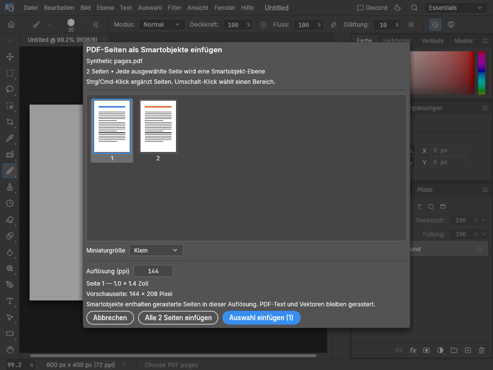

# PDF import and export

PhotoCraft supports PDF in File > Open, drag-and-drop, Save As, Export As,
and the CLI's convert and batch operations.

File > Export > Export All Tabs to PDF combines the current tabs into one binder,
in left-to-right tab order, including their current edits. Each canvas or artboard
becomes a page at its own size and resolution. Optionally select "Close exported
tabs after successful export". Closing happens only after the complete PDF has
been atomically saved; cancellation or failure leaves the tabs intact. Tabs opened
or changed after export began remain open. Export does not change source files or
the saved state of tabs that remain open.

Opening or dropping a PDF shows a page picker before changing documents.
Pages appear as a thumbnail grid with page numbers below each miniature. The first
page is selected initially. Click a miniature to select one page, Ctrl/Cmd-click to
add or remove pages, or Shift-click to select an inclusive range. Choose Small,
Medium or Large thumbnail size. Visible pages load serially in the background;
the preview cache holds at most 32 pages and is independent of import resolution.



With an open document, Place selected inserts one embedded smart object per selected
page into that document; Place all pages inserts the whole binder. Pages are centered
and fitted to the canvas when larger. The Layers panel retains binder order, and the
entire insertion is one Undo step. The destination is captured when the picker opens:
switching tabs does not redirect placement, and closing the destination fails without
changing another document. File > Place Embedded also uses this picker for PDFs.
Each source is a raster page stored as an embedded .pcraft document, so Smart Object
Edit Contents and transformations retain its original pixels. Original PDF vectors
are not embedded or rerendered at higher zoom. The target canvas, color mode, bit depth
and save path remain unchanged. Save .pcraft to retain the smart objects.
Pixel painting does not convert smart objects. Rasterize the layer explicitly through
Layer > Rasterize > Smart Object (or the layer context menu) before painting its pixels.
Painting a smart object's mask remains available without rasterizing its contents.

Without an open document, or when dropping onto the tab strip, Open selected and
Open all pages create separate named RGB 8-bit tabs in binder order. Choose
Resolution (1–2400 ppi, default 144) before confirmation. Resolution
changes the pixel dimensions while preserving the physical page size.
Cancel leaves existing documents untouched. The CLI retains multipage
artboard import for batch conversion.
If synchronous import fails, the picker retains its pages and resolution so the
setting can be corrected and retried without reopening the PDF.

This picker supports raster smart objects and separate raster documents.
Embedded-image/3D selection and configurable PDF
page boxes are not exposed. No unsupported options are shown as working controls.
Crop and Trim resize a single-page artboard along with its canvas, so PDF exports
use the cropped page dimensions instead of retaining the original blank sheet.
Crop boxes and page rotation are applied by Hayro, the pure Rust PDF renderer.
Imported PDFs have no automatic overwrite path.

Save As > PDF and Export As > PDF write one page per artboard, top to bottom in
the Layers panel. An ordinary image document becomes a single-page PDF. Exports
use lossless compression, 8-bit sRGB pixels, embedded ICC colour information,
and soft masks for transparency. Physical page size comes from pixel dimensions
and document resolution. Export As > Metadata > None omits XMP metadata.
Print, Artboards to PDF and document/binder export share the raster PDF writer
in `photocraft-io::pdf_writer`. Printing retains its marks, labels and printer ICC
handling; Artboards to PDF retains JPEG output and its quality setting.
Export All Tabs to PDF is a PhotoCraft extension outside the Photoshop parity catalog.

PDF text, vector objects, links, forms, annotations, and signatures are not
preserved as editable PDF objects. These are raster image editing workflows.
Use .pcraft for an editable layered master and PDF for the exported result.
Password-protected PDFs must first be unlocked in a PDF editor.

Native import limits: 100 pages; 16,384 pixels per output side; 64 megapixels per
rendered page; 512 megapixels total; 256 MB input file. Before rendering or previews,
embedded image dictionaries and JPEG frame headers are checked (16,384 pixels per
side, 16 megapixels per image, 64 megapixels aggregate; JPEG frames count in addition
to their dictionaries). Flate inflation is checked in 8 KB chunks with cancellation,
64 MB per decoded stream and 256 MB aggregate. Predictor dimensions are bounded.

This version deliberately rejects codecs without enforceable decode budgets:
JPEG2000/JPX, JBIG2, CCITT and LZW, plus filter chains and inline images. It accepts
unfiltered, Flate and JPEG streams and supported device/ICC/indexed image color
spaces. Unsupported input returns an error rather than opening a page with missing
artwork. Resave unsupported PDFs with JPEG or Flate image XObjects. Inline-image
detection is conservative and can also reject a literal `BI` token in a stream.
These checks bound supported stream/image decoding, not all allocations or runtime
in the third-party parser and interpreter. Cancellation is checked during preflight
and before/after each render; Hayro itself has no mid-render cancellation hook.

Web PDF import and previews return a desktop-app-required error **before parsing**.
The web editor cannot safely isolate Hayro's allocations/panics, and `catch_unwind`
cannot protect a no-unwind WebAssembly build. Existing documents and PDF export
remain usable. This is deliberate graceful degradation, not browser PDF import support.

To execute the no-unwind web regression (using the matching wasm-bindgen CLI):

```sh
cargo build --release -p photocraft-io --example pdf_web_smoke --target wasm32-unknown-unknown
wasm-bindgen --target nodejs --out-dir target/pdf-web-smoke target/wasm32-unknown-unknown/release/examples/pdf_web_smoke.wasm
node -e "console.log(require('./target/pdf-web-smoke/pdf_web_smoke.js').pdf_web_smoke())"
```

Build with `cargo build --release -p photocraft -p photocraft-cli`.
The focused regression tests are `cargo test -p photocraft-io --test pdf`.
The retry and tab workflow regressions are
`cargo test -p photocraft-ui-egui --test pdf_workflow`.
Synthetic page-picker screenshots in every theme, at 800×600 and 1000×750 points
and 1×/2× scale, can be reproduced with
`cargo run -p photocraft-ui-egui --example pdf_import_demo -- plan/evidence`.
`file.export.allTabsPdf` also accepts `{ "path": "binder.pdf", "closeAfter": false }` from the local CLI command runner.
