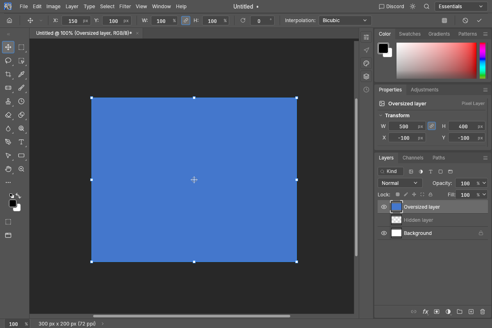
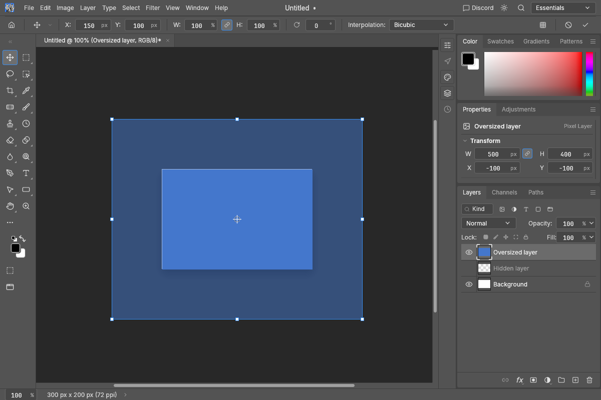

# Transform overflow preview

During a layer's Free Transform, perspective transform or Warp, preview pixels outside its
containing artboard (or ordinary document canvas) use half their existing opacity. Inside pixels
retain their opacity. Transform handles remain visible; committed pixel data is unchanged.
Selection-outline transforms and transforming an artboard itself retain their existing preview.

The before/after images show an original synthetic 500 × 400 pixel blue layer on a 300 × 200
pixel canvas, using the CPU canvas at 1200 × 800 and 1× UI scale. The Layers panel is unchanged.

| Before (main) | After |
| --- | --- |
|  |  |

Regression coverage verifies unchanged opacity inside and half of the existing opacity outside
for opaque and translucent pixels, including fully outside and partially clipped previews.
Disjoint clipping rectangles prevent translucent pixels from being composited twice.
