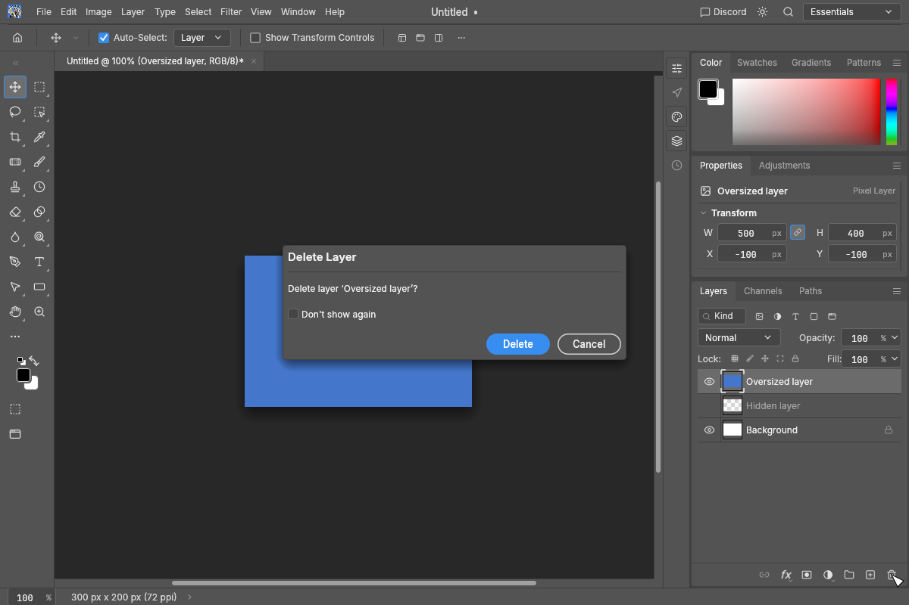

# Trash-button deletion confirmation

Clicking the Layers panel's trash button asks before deleting the selected layer(s), with
Delete, Cancel and Don't show again. The preference is saved only after a successful confirmed
deletion. Cancelling preserves both the layers and the preference.

Keyboard shortcuts, menu deletion, dropping a layer onto the trash, automation and empty text
layer cleanup keep their existing behavior. The default Delete shortcut stays on `edit.clear`.
Main's hidden-eye rendering is unchanged.

The confirmation refuses to delete if the document or selected layers changed while it was
open. Prompts and errors have translations in every supported non-English catalog.

